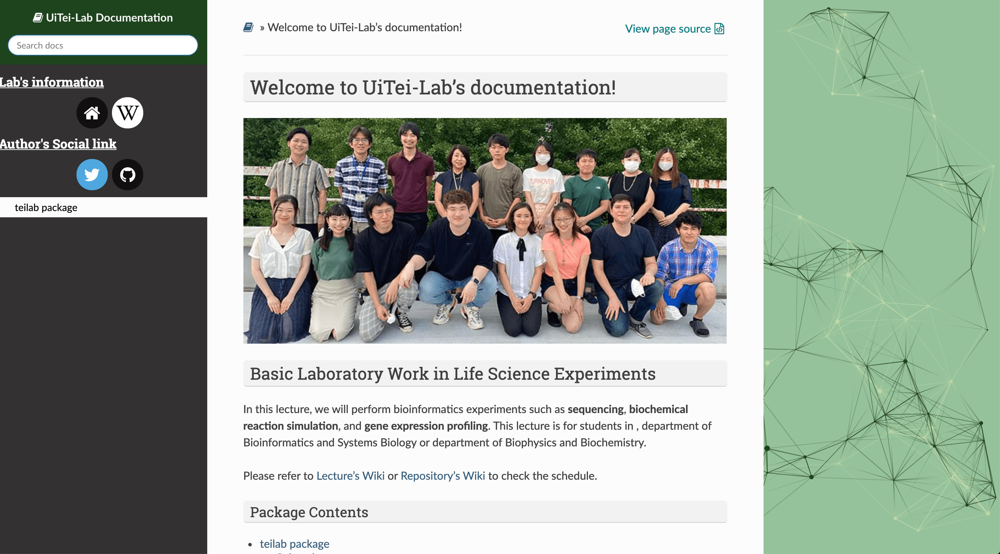

# 生命科学基礎実験

シークエンシング、生化学反応シミュレーション、および遺伝子発現プロファイリング等の生物情報科学的実験を行う。本実習は、生物化学科と合同で実施する。


[](https://github.com/iwasakishuto/TeiLab-BasicLaboratoryWork-in-LifeScienceExperiments)
[](https://github.com/iwasakishuto/TeiLab-BasicLaboratoryWork-in-LifeScienceExperiments/blob/master/.github/workflows/install_this_package.yml)


[](https://github.com/iwasakishuto/TeiLab-BasicLaboratoryWork-in-LifeScienceExperiments/blob/master/LICENSE)
[](http://ui-tei.rnai.jp/microarray/doku.php?id=%E7%A8%8B%E7%A0%94%E5%AE%9F%E7%BF%92:2022)
[](http://ui-tei.rnai.jp/)
[](https://iwasakishuto.github.io/TeiLab-BasicLaboratoryWork-in-LifeScienceExperiments/index.html)
[](https://www.twitter.com/messages/compose?recipient_id=1042783905697288193&text=2021年度の生命科学基礎実験を受講しているものですが、)
[](https://colab.research.google.com/github/iwasakishuto/TeiLab-BasicLaboratoryWork-in-LifeScienceExperiments/blob/main/notebook/Colaboratory/microarray2022S.ipynb)

## 講義基本情報

|時間割／共通科目コード|コース名|教員|学期|時限|
|:-:|:-:|:-:|:-:|:-:|
|0560527<br>FSC-BI3B07P1|生命科学基礎実験|程　久美子|S2|火曜3限、火曜4限 他|

|教室|単位|他学部履修|講義使用言語|実務経験のある教員による授業科目|開講所属|
|:-:|:-:|:-:|:-:|:-:|:-:|
|理学部３号館 015|3|不可|日本語|NO|理学部|

※ スケジュール等は[実習wiki](http://ui-tei.rnai.jp/microarray/doku.php)や[このRepositoryのwiki](https://github.com/iwasakishuto/TeiLab-BasicLaboratoryWork-in-LifeScienceExperiments/wiki)を参照して下さい

## パッケージについて

```sh
$ pip install "git+https://github.com/iwasakishuto/TeiLab-BasicLaboratoryWork-in-LifeScienceExperiments.git"
```

などのコマンドによって、 `teilab` という module をインストールすることができます。この module は

* 講義で使用するデータのダウンロード
* 講義で使用するデータの読み込み
* 匿名での質問

などの、講義で便利な関数を収録していますが、その他にも楽にXYplotやMAplotを描くことのできる関数も収録されています。そちらの使い方を確認したい方は、[ドキュメントを確認](#-ドキュメントを確認したい)されるか、以下のノートブックを参照してください。

* `plotly` でグラフを描画したい方: [`notebook/Local/Main-Lecture-Material-plotly.ipynb`](https://nbviewer.jupyter.org/github/iwasakishuto/TeiLab-BasicLaboratoryWork-in-LifeScienceExperiments/blob/main/notebook/Local/Main-Lecture-Material-plotly.ipynb)
* `matplotlib` でグラフを描画したい方: [`notebook/Local/Main-Lecture-Material-matplotlib.ipynb`](https://nbviewer.jupyter.org/github/iwasakishuto/TeiLab-BasicLaboratoryWork-in-LifeScienceExperiments/blob/main/notebook/Local/Main-Lecture-Material-matplotlib.ipynb)

## 使い方

環境構築の容易さという観点から、基本的には[Google Colaboratory](https://research.google.com/colaboratory/)を用いて講義を行いますが、

* [🤗 ドキュメントを確認したい。](#-ドキュメントを確認したい)
* [👍 自分のローカル環境で実行したい。](#-自分のローカル環境で実行したい)
* [👏 Pull Requestを送りたい](#-pull-requestを送りたい)

といった方々向けに使い方を簡単に記載します。

### 🤗 ドキュメントを確認したい

1. 右上の \[Code\] というボタンから Download ZIP を押して、ZIPファイルをダウンロードします。
2. ダウンロードしたフォルダ内の `docs` -> `index.html` をクリックして、お好きなブラウザ（Google Chromeを推奨）で開いて下さい。以下のような画面が現れると思います。



※ なお、ドキュメントは[ここ](https://iwasakishuto.github.io/TeiLab-BasicLaboratoryWork-in-LifeScienceExperiments/index.html)からでも確認できます。

### 👍 自分のローカル環境で実行したい

* [Pyenv](https://github.com/pyenv/pyenv#installation)：異なるバージョンのpython環境を柔軟に構築
* [Poetry](https://github.com/python-poetry/poetry#installation)：パッケージのバージョンや依存関係を記録

を用いて、実行環境を作成することを推奨します。また、作成した環境でローカルのJupyter Notebookを起動したい場合は、<a href="https://nbviewer.jupyter.org/github/iwasakishuto/TeiLab-BasicLaboratoryWork-in-LifeScienceExperiments/blob/main/notebook/Local/Start-JupyterNotebook-with-Poetry-Environment.ipynb">このNoteBook</a>を参照して下さい。

```sh
$ git clone https://github.com/iwasakishuto/TeiLab-BasicLaboratoryWork-in-LifeScienceExperiments.git
$ cd TeiLab-BasicLaboratoryWork-in-LifeScienceExperiments
$ pyenv install 3.8.9
$ pyenv local 3.8.9
$ python -V
Python 3.8.9
$ poetry install
```

<b>※ わからないことがあれば適宜質問して下さい。</b>

### 👏 Pull Requestを送りたい

一応テンプレートを用意していますが、好きなように送って下さい☺️
